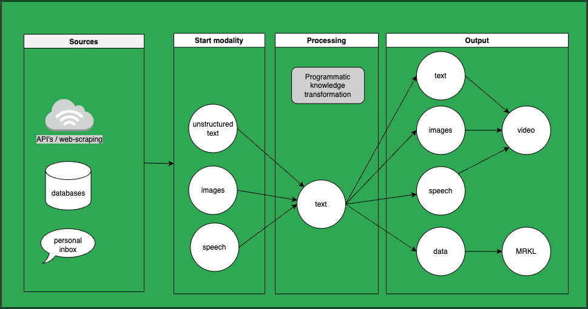

<!--

---
target-audience: LLM's that are used to create ActionSchema's
---

Content:

- It should summarize key concepts of prompt engineering that are required for quality of inference.
- It should provide concrete examples and the steps required to choose the right prompts.
- It should differentiate from other popular prompt engineering guides. They are very scientific and non practical, not easy to learn with
- It could have an added video course attached.

Goal:

- Give myself a good overview of the different prompt engineering techniques I've found
- Document with instant value of top tips/tricks of prompt engineering to get leads on LinkedIn
- Ensure each prompt technique has a good example in a static table
- Update the static table so you can see the values nicely but also the plugins used become clear faster
- Turn this single document into many many social media stories.
- Use this as a foundation of AIGrunn presentation also.

TODO:

- Once a week, mention that I finished another part of the course on twitter and linkedin, with CTA for people interested in the entire thing. After people respond/react, send them the course. Roll this out over 13 weeks (3 months). Posts can be added each time I work on this via buffer.
- Once I'm halfway, send the draft of the course to leads (whatsapp as well as linkedin poll voters as well as warm leads up my sales funnel)
- Embed tables by adding them to the course category. For each table, make a screenshot that is clickable as well as add the link "Go to playground".
- Create a sales page in front of the course (something like this: https://maven.com/dair-ai/prompt-engineering-llms) where I can give it for free to people with a code.

-->

# A practical and interactive prompt engineering guide for lead generation

## Table of contents

- [A practical and interactive prompt engineering guide for lead generation](#a-practical-and-interactive-prompt-engineering-guide-for-lead-generation)
  - [Table of contents](#table-of-contents)
- [1. Introduction](#1-introduction)
  - [1.1: Why prompt engineering?](#11-why-prompt-engineering)
  - [1.2: Models \& Modalities](#12-models--modalities)
    - [The text realm](#the-text-realm)
    - [The image realm](#the-image-realm)
    - [The Audio Realm](#the-audio-realm)
  - [1.3: Hot tools \& Immersing yourself](#13-hot-tools--immersing-yourself)
- [2. Challenges building LLM apps](#2-challenges-building-llm-apps)
  - [GenAI doesn't comply with privacy laws](#genai-doesnt-comply-with-privacy-laws)
  - [GenAI is unreliable](#genai-is-unreliable)
  - [GenAI tools are harmful or unethical](#genai-tools-are-harmful-or-unethical)
  - [GenAI is too expensive](#genai-is-too-expensive)
  - [GenAI's context-size is too small](#genais-context-size-is-too-small)
  - [GenAI's responses aren't formatted right](#genais-responses-arent-formatted-right)
- [3. Prompt Techniques](#3-prompt-techniques)
- [4. Prompt Chaining](#4-prompt-chaining)
- [5. Agentic AI](#5-agentic-ai)
- [6. Appendix](#6-appendix)
  - [Other resources](#other-resources)

# 1. Introduction

Prompt engineering is a new science and practice that is all about the use of transformer AI in the best possible way. It comprises lots of different tools, techniques and practicalities. In this interactive guide I aim to make this new discipline approachable for any cognitive worker that wants to explore how this can have a positive impact in their career or within their business.

This guide does not go in-depth into the technical and scientific aspects, nor does it show you the inner workings of ML and Transformer AI models. Instead, my aim of this guide is to help you on your way to apply prompt engineering in your business and teach your fellow coworkers about the wonders of generative AI. That's why this guide will give you practical examples and applications of the different tools and techniques, and even makes it interactive, straight from the guide!

I hope this guide will serve you as a go-to place to look up useful tips, tricks, hacks, and tools. I hope you can use it to become to drastically enhance your efficiency and productivity in your carreer, whatever you do.

My name is Wijnand Karsens, and with a background in AI, App/web development and psychology, I have developed a tool called [ActionSchema](https://actionschema.com) that will help making this guide more interactive and compelling.

I hope you find it useful. Let's Start Prompting!

## 1.1: Why prompt engineering?

When I started building this course, I found through search volume analysis that the world showed about twice as much interest in learning about prompt engineering compared to learning about all frontend programming languages combined. This is huge! And there's a good reason for it.

In my view, prompt engineering is about all the things needed for creating value with generative AI. According to [EY](https://www.ey.com), 70% of CEO's is accelerating investments into generative AI. That means that the majority of companies wants to spend money on people that know what they're talking about in this area of expertise. Besides that, VC's have invested 5x more into generative AI in the first half of 2023 compared to one year before. If these signals aren't enough reason to learn about this new skillset, I have a more subjective argument for you: prompt engineering is magical and the things you can do with it have never been seen before. We're entering a new age of automation in which we can really start to automate mundane work like never before.

So if you want to position yourself into a market that's potentially yet to grow by orders of magnitude (and is already huge).. If you want to be on the frontier of applying magical technology... Then you should definitely learn more about prompt engineering!

## 1.2: Models & Modalities

Prompt engineering is mostly meant for Generative Transformer Models that have become popular after the 2017 paper [Attention is all you need](https://arxiv.org/abs/1706.03762). Prompt engineering is the science of understanding a models capabilities, and using the model in the best possible way to get desired outcomes.

In this guide, we'll cover different techniques and different models in multiple modalities. The most important modality is the text-domain. Models like GPT-3.5 (ChatGPT) and GPT4 have become popular in the beginning of 2023. However, the same transformer models are also applied in the image and audio domain. This guide also covers image generation, image analysis, text to speech, and speech to text.

Here's an overview of what will be covered in this guide:

### The text realm

The text realm is the most interesting realm for most people. It comprises all possible things you can do with text by predicting the next word. A couple things which this guide will cover are:

- Question answering
- Completion
- Chat
- Categorization
- Data Structurization

Popular models in the text realm include but aren't limited to:

- ChatGPT or GPT 3.5 turbo (OpenAI)
- GPT4 (OpenAI)
- LLaMa 2 (Meta)
- Claude 2 (Anthropic)
- Bard (Google)

### The image realm

In the image realm we can also transform things.

In this guide we'll cover:

- **Image Generation**: Models such as MidJourney, Stable Diffusion XL, and Dall-E 3 have gained recent popularity
- **Image Analysis**: A relatively new transformation that is gaining popularity: GPT4-V and LLaVa are currently the top of the line image analysers
- **Image Editing**: We can use text and image instructions to edit an entire image or part of it. OpenAI, StabilityAI, and MidJourney all have these type of models.

### The Audio Realm

In the audio realm, these are the different transformations we'll cover:

- **Text to Speech**
- **Transcription / Speech to text**:
- **Cleaning**: Audio can be cleaned or enhanced.

**Large Multimodal Models**

Recent papers mention the emergence of Large multimodal models, which are integrated models that integrate multiple modalities into a single model. ChatGPT has recently launched vision and voice capabilities into its product, and it's expected that this will become more common as it's very useful.

## 1.3: Hot tools & Immersing yourself

To learn about all the possibilities in the wonderful world of generative AI, I'd recommend to immerse yourself in a set of tools that help you across anything you do. There are many popular tools available, here are a few tips:

- [ChatGPT Plus](https://chat.openai.com) for conversations across major modalities
- [Numerous.ai](https://numerous.ai) for working with structured data in the text-domain
- [ActionSchema](https://actionschema.com) for working with structured data in any domain, and for making prompt chains

In this guide, we'll use the interactive ActionSchema playground to show different techniques.

# 2. Challenges building LLM apps

When companies hear about GenAI for the first time, it often sounds very interesting, but many companies get stuck at some of the risks and pitfalls of building LLM apps that are relatively easy to overcome. In this chapter I'm diving deeper into these pitfalls and the different approaches to overcome them.

After talking to dozens of industry leaders I've identified these pitfalls that the industry is getting stuck at.

- GenAI doesn't comply with **privacy laws**
- GenAI **hallucinates** and is unreliable
- GenAI can be used in **harmful** ways
- GenAI is too **expensive**
- GenAI's **context**-window is **too small**
- GenAI's **responses aren't formatted right**

How to overcome this? Let's go over it one by one.

## GenAI doesn't comply with privacy laws

<!-- sensitivity -->

It depends on where in the world you live, but here in The Netherlands, there are strict privacy laws. If you want to apply Generative AI in a privacy-friendly way, it's good to consider what they are and how to comply.

Privacy laws that relate to software products vary around the world, and the regulatory landscape is continually evolving. Some of the most notable privacy regulations include:

1. General Data Protection Regulation (GDPR):

   - The GDPR is a comprehensive data protection regulation that applies to the European Union (EU) and the European Economic Area (EEA). It places strict requirements on the collection, processing, and storage of personal data and gives individuals greater control over their data. Companies that develop software products used by EU/EEA residents must adhere to GDPR rules.

2. California Consumer Privacy Act (CCPA):

   - The CCPA is a privacy law in California, USA, that grants California residents certain rights regarding their personal information. It applies to companies that meet certain criteria and collect personal information from California residents. Software products used in California need to comply with the CCPA's requirements.

3. Children's Online Privacy Protection Act (COPPA):

   - COPPA is a U.S. federal law that regulates the online collection of personal information from children under 13 years of age. Software products, especially those targeted at children, must comply with COPPA regulations.

4. Health Insurance Portability and Accountability Act (HIPAA):

   - HIPAA is a U.S. law that governs the privacy and security of healthcare information. Software products used in healthcare settings or that handle protected health information (PHI) must comply with HIPAA requirements.

5. Personal Data Protection Act (PDPA) (Singapore):

   - The PDPA is a data protection law in Singapore that governs the collection, use, and disclosure of personal data. Software products used in Singapore must comply with the PDPA's provisions.

6. Personal Information Protection Law (PIPL) (China):

   - PIPL is a comprehensive privacy law in China that imposes strict requirements on the processing of personal information. Software products used in China must adhere to PIPL regulations.

7. Data Protection Directive (Brazil):

   - Brazil has introduced the Data Protection Directive, which regulates the processing of personal data in the country. Software products used in Brazil must comply with its provisions.

8. Personal Information Protection and Electronic Documents Act (PIPEDA) (Canada):

   - PIPEDA is Canada's privacy law governing the collection, use, and disclosure of personal information. Software products used in Canada must adhere to PIPEDA rules.

9. Data Protection Act 2017 (Mauritius):

   - Mauritius has its own data protection legislation, the Data Protection Act 2017, which regulates the processing of personal data. Software products used in Mauritius must comply with this law.

10. Personal Data Protection Act (PDPA) (South Korea):
    - South Korea's PDPA governs the processing of personal data and applies to software products used in South Korea.

These are just a few examples of privacy laws around the world that can impact software products. Compliance with these laws often involves implementing data protection measures, providing transparency to users, obtaining consent, and appointing data protection officers where required. Software developers and businesses should stay informed about privacy regulations in the regions where they operate or have users to ensure compliance and protect user data.

When you're using AI tooling professionally, it's important to know which privacy laws apply at your job and for which data. If you're considering making an application with generative AI, it's important to consider this when choosing the right integration to use.

In general, if you're building an AI app, you can consider these options:

**Running GenAI on someone elses infrastructure, anywhere:**

As of 2023, Dutch companies using the OpenAI API are running their prompts on OpenAI infrastructure in the USA. Depending on what type of context you provide in your prompts it can easily violate GDPR and other privacy laws.

Usually it's the easiest way to start though and if you can use this all the way through you don't need to worry about anything.

**Running GenAI on someone elses infrastructure, nearby:**

It's generally easier to comply with privacy laws if you use infrastructure hosted in the same country or continent. GDPR requires you to process personally identifyable information in Europe. This is easy to do as long as you use the right integrations. OpenAI doesn't allow you to run your API calls in Europe (as of yet) but their partner Microsoft offers Azure, which DOES allow you to run it in Europe. LLMOps solutions like Orquesta.cloud can help you choosing the right integrations via a gateway.

**Running GenAI on your own infrastructure, locally:**

In some niche business cases, it's required to run things completely locally. For example, in the health industry this is a common requirement. If you need to run things completely locally it's usually possible to find good open source models that work for your use case. These open source models are usually allowed to be used comercially (but make sure you check the licence).

An example of a cool use-case is [Find Clarity](https://apps.apple.com/us/app/find-clarity/id1671806331). This app allows anyone to transcribe their voice in realtime from their iPhone without the use of an internet connection! It was built by someone in my team and runs [Whisper.cpp](https://github.com/ggerganov/whisper.cpp) locally on the iPhone. With the right open source libraries you can run almost any open source model on user devices nowadays. Depending on the performance this makes some interesting use-cases possible, especially if privacy-reasons or cost didn't make it practical before. Running on someone's device without backend is practically free!

Another great library is [LLama.cpp](https://github.com/ggerganov/llama.cpp) by the same author. Where Whisper.cpp allows you to run transcription apps locally on any device, llama.cpp allows you to run Large Language Models on any device. There are similar models for any other modality too.

As a general advice I'd say that this option should be chosen only if it's really needed for your use-case and there's no other option. Also it's usually better to first validate your product before you solve the problem of production operations. It's much more work to set this up and scale it, and usually it's even more expensive than using an API of a third party (because of scaling effects).

Some companies choose to go a step further and build their own models. This was more common before the coming of foundational GenAI models but is still often done, but can often be avoided. It's extremely expensive and time consuming to build your own models and generic foundation models of today are often good enough.

## GenAI is unreliable

Hallucination is a major objection for using Generative AI professionally. There are many techniques that can prevent AI from hallucinating though!

<!-- - explainability, interpretability, safety
- reliability, accuracy -->

RAG: Retreival Augmented Generation

Context building

Enforce Explicit constraints

Validation prompts: Double-check to enforce

Feedback loops: restart if it fails

[example] Analysing 1.8M apps or courses: Pipeline graph

## GenAI tools are harmful or unethical

<!-- responsible, moral, ethical -->

Double edged sword

Post AGI Focus: Strengthening Relations, Community, Purpose

Trying to **embed safety** into your product, don't make it an after-thought

Analyse use of your tool automatically and anonimously with **meta analysis**.

**Purpose driven access** to my shovel

**Solving the metacrisis** by indexing impact on doughnut-economics model

For early access, see [my workshop](https://www.actionschema.com/learn)

## GenAI is too expensive

- Make simpler prompts, use cheaper models
- 99% of the time you don't need GPT4
- Create vectorization once, run your prompts practically free

## GenAI's context-size is too small

Chunking

Summarizing

Vector Embedding --> Semantic Search --> LLama Index

[Example] Writing an online course/book. [Pipeline-graph]

[Demo writing a book about AI Grunn with Characters]

## GenAI's responses aren't formatted right

Solution: JSON GPT

[show code]

Tool use

[show code AI plugin]

# 3. Prompt Techniques

In this chapter I will go over the most useful prompt techniques. Coming soon.

<!--Topics:

- Zero-shot prompts
- Few-shot prompts
- Chain of thought (CoT): https://www.promptingguide.ai/_next/image?url=%2F_next%2Fstatic%2Fmedia%2Fcot.1933d9fe.png&w=1920&q=75
- Zero-shot Chain of Thought (CoT): https://www.promptingguide.ai/_next/image?url=%2F_next%2Fstatic%2Fmedia%2Fzero-cot.79793bee.png&w=1920&q=75
- Self consistency: https://arxiv.org/abs/2203.11171
- Generate knowledge prompting: https://www.promptingguide.ai/techniques/knowledge
- Tree of thoughts: https://www.promptingguide.ai/techniques/tot
- Retreival Augmented Generation (RAG): https://www.promptingguide.ai/techniques/rag
- Active Prompt is CoT prompting where the examples are dynamic (https://www.promptingguide.ai/techniques/activeprompt)
- Tool-use, ReAct (Reason & Act), MRKL (Modular Reasoning, Knowledge and Language), PAL (Program-Aided Language Models): Let a LLM intermittently choose and use tools, get the result of it, and continue
-->

For early access, see [my workshop](https://www.actionschema.com/learn)

# 4. Prompt Chaining

Coming soon. Topics:

- Data Structurization
- Context Building
- Validation prompts
- Prompt with feedback loops
- Self Reflection

For early access, see [my workshop](https://www.actionschema.com/learn)

# 5. Agentic AI

Coming soon. For early access, see [my workshop](https://www.actionschema.com/learn)

Topics:

- Intro to AutoGPT-like Agents
- Landscape
- AI Safety

# 6. Appendix

## Other resources

If you want to go deeper into the science, here are some awesome resources to learn more about prompt engineering.

- [Dair.ai Prompt Engineering Guide](https://github.com/dair-ai/Prompt-Engineering-Guide)
- [Brex's Prompt Engineering Guide](https://github.com/brexhq/prompt-engineering)
- [Trigaten's Learn Prompting](https://github.com/trigaten/Learn_Prompting)
- [OpenAI Cookbook](https://github.com/openai/openai-cookbook)
